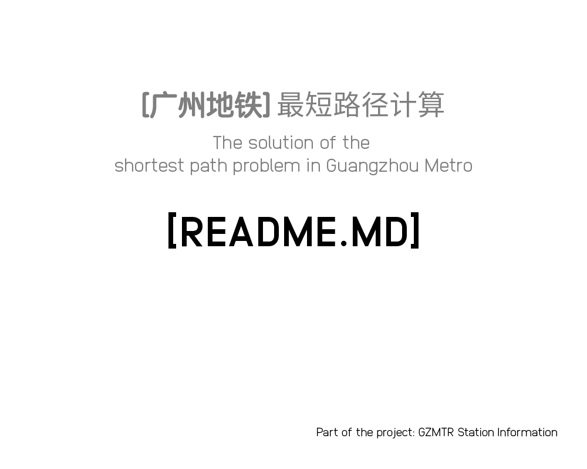

# GZMTR Shortest Path Calculator
GZMTR Shortest Path Calculator is a C++ program for calculate the shortest path between stations. This progran support to simply calculate the price, the route as well.



[ENGLISH](README.md) [CHINESE](README.cn.md)
:grinning: Thanks for your visiting.

## Installing
Simply clone this repo.

## Usage
Use your C++ compile, such as G++ or CMake

```shell script
g++ main.cpp -o ./exec
./exec
```

## Contributing
Pull requests are all kindly welcome. For major changes, please open an issue first to discuss what and why you'd like to change.

## License
Under Creative Commons V3 BY-SA

## DOC
We have functions:
```c++
void getSourceAndTarget() // -> Get Source and Get Target ID, eg: 0 240
void initPath() // -> init all links between vertices as infinite or 0
void readPath() // -> Get source from data.in in this format: id1 id2 time-cost length, all parameters are Int
void initData() // -> Make exists data into Time, dis, res
int priceCalc(int distance) // -> Return Price
void printResult() // -> Print result in this format: targetID time-cost result price
void dijkstra() // -> Calc
```

We actually have these files:
|---Root
 |---main.cpp // the program file
 |---data.in // store the data
 |---src.in // where user input the source and the target
 |---data.out // where the program outputs the result